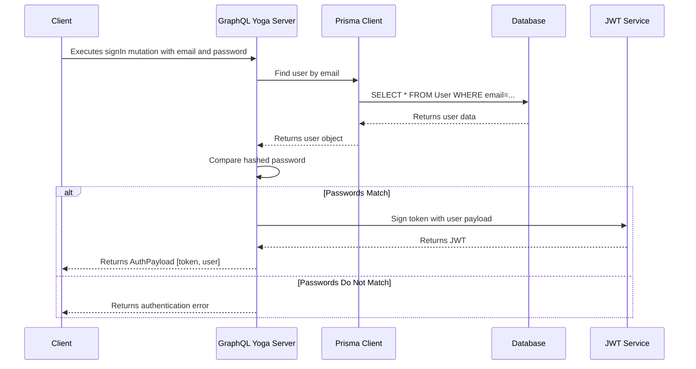

# WellPNA Backend Architecture

This document outlines the architecture and development guidelines for the WellPNA GraphQL backend.

## Guiding Principles

1.  **Pure GraphQL:** The server exposes a single GraphQL endpoint for all client-server communication. There are no REST endpoints.
2.  **Code-First Schema:** The GraphQL schema is built using Pothos, a code-first schema builder. This ensures type safety and allows us to leverage TypeScript for our schema definitions.
3.  **Separation of Concerns:** Business logic is handled directly within GraphQL resolvers. Database interactions are managed by the Prisma Client. Utility functions are kept in a separate `utils` directory.
4.  **Standalone Server:** We use GraphQL Yoga's standalone server. We do not use a separate web framework like Fastify or Express.

## Authentication Flow

The following diagram illustrates the `signIn` mutation flow:

## Project Structure

The `src` directory is organized as follows:

-   `src/`
    -   `builder.ts`: Pothos schema builder configuration.
    -   `client.ts`: Prisma client instance.
    -   `schema.ts`: Root schema definition, where all types, queries, and mutations are imported.
    -   `server.ts`: Standalone GraphQL Yoga server setup.
    -   `generated/`: Auto-generated files from Prisma and Pothos. **Do not edit manually.**
    -   `graphql/`: Contains all GraphQL-related code.
        -   `types/`: GraphQL object type definitions (e.g., `User.ts`, `Auth.ts`).
        -   `queries/`: GraphQL queries (e.g., `user.ts`).
        -   `mutations/`: GraphQL mutations (e.g., `auth.ts`).
    -   `utils/`: Utility functions (e.g., `auth.ts` for password hashing and JWT).

## Development Rules

1.  **GraphQL Types:** All GraphQL object types must be defined in the `src/graphql/types` directory. Each type should be in its own file (e.g., `User.ts`).
2.  **GraphQL Queries:** All GraphQL queries must be defined in the `src/graphql/queries` directory.
3.  **GraphQL Mutations:** All GraphQL mutations must be defined in the `src/graphql/mutations` directory.
4.  **Business Logic:** All business logic should be contained within the `resolve` function of a query or mutation. We are not using a separate service layer.
5.  **Database Access:** All database interactions must go through the Prisma client, which is available on the context (`ctx.prisma`).
6.  **Schema Imports:** All types, queries, and mutations must be imported into `src/schema.ts` to be included in the final schema.
