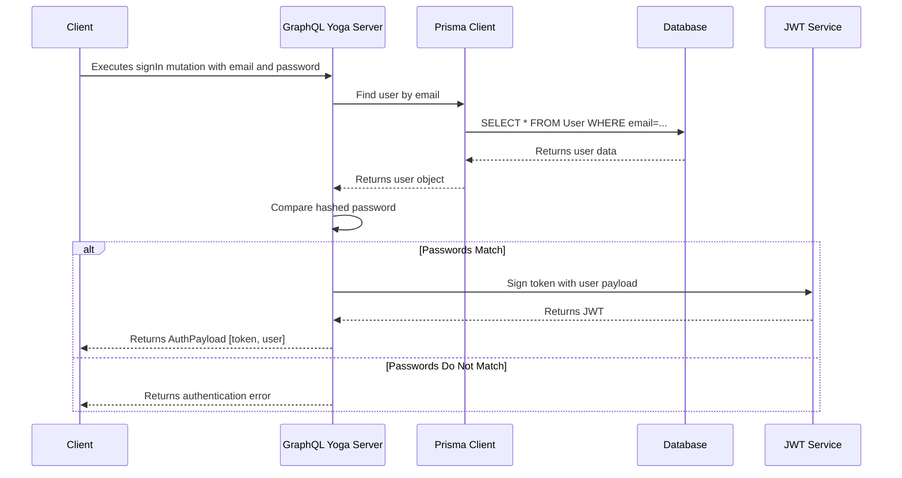

# WellPNA Backend Architecture

This document outlines the architecture and development guidelines for the WellPNA GraphQL backend.

## Guiding Principles

1. **Pure GraphQL:** The server exposes a single GraphQL endpoint for all client-server communication. There are no REST endpoints.
2. **Code-First Schema:** The GraphQL schema is built using Pothos, a code-first schema builder. This ensures type safety and allows us to leverage TypeScript for our schema definitions.
3. **Separation of Concerns:** Business logic is handled directly within GraphQL resolvers. Database interactions are managed by the Prisma Client. Utility functions are kept in a separate `utils` directory.
4. **Standalone Server:** We use GraphQL Yoga's standalone server. We do not use a separate web framework like Fastify or Express.

## Authentication Flow

The following diagram illustrates the `signIn` mutation flow:



## Project Structure

The `src` directory is organized as follows:

- `src/`
  - `builder.ts`: Pothos schema builder configuration.
  - `client.ts`: Prisma client instance.
  - `schema/index.ts`: Root schema definition, where all types, queries, and mutations are imported.
  - `server.ts`: Standalone GraphQL Yoga server setup.
  - `generated/`: Auto-generated files from Prisma and Pothos. **Do not edit manually.**
  - `graphql/`: Contains all GraphQL-related code.
    - `types/`: GraphQL object type definitions (e.g., `User.ts`, `Auth.ts`).
    - `queries/`: GraphQL queries (e.g., `user.ts`).
    - `mutations/`: GraphQL mutations (e.g., `auth.ts`).
  - `services/`: Service layer for external integrations (e.g., `emailService.ts`).
  - `utils/`: Utility functions (e.g., `auth.ts` for password hashing and JWT).

## Development Rules

1. **GraphQL Types:** All GraphQL object types must be defined in the `src/graphql/types` directory. Each type should be in its own file (e.g., `User.ts`).
2. **GraphQL Queries:** All GraphQL queries must be defined in the `src/graphql/queries` directory.
3. **GraphQL Mutations:** All GraphQL mutations must be defined in the `src/graphql/mutations` directory.
4. **Business Logic:** All business logic should be contained within the `resolve` function of a query or mutation. We are not using a separate service layer.
5. **Database Access:** All database interactions must go through the Prisma client, which is available on the context (`ctx.prisma`).
6. **Schema Imports:** All types, queries, and mutations must be imported into `src/schema.ts` to be included in the final schema.
7. **Logging:** Use the logger utility (`src/utils/logger.ts`) instead of `console.log` or `console.error`. Available methods: `logger.info()`, `logger.debug()`, `logger.warn()`, `logger.error()`.

## Testing

Run `npm test` to execute the test suite using Vitest. Tests are configured to use real data for integration testing, ensuring comprehensive validation of GraphQL operations and database interactions. Only email services are mocked to avoid external dependencies.

The test suite includes:

- Authentication tests (`auth.test.ts`)
- User management tests (`updateUser.test.ts`, `updateUserRole.test.ts`)
- Utility function tests (`utils.spec.ts`)
- Helper functions and setup/teardown scripts

## Building for Production

Run `npm run build` to compile the TypeScript code and generate the GraphQL schema. The build artifacts will be stored in the `dist/` directory.

## Deployment

Unlike the frontend, the backend is a Node.js server and cannot be deployed as static files. It requires a runtime environment that supports Node.js.

### Production Deployment

1. Build the backend: `npm run build:backend` (from root directory)
2. Install dependencies: `npm run install:backend` (from root directory)
3. Set environment variables (DATABASE_URL, JWT_SECRET, NODE_ENV=production)
4. Start with PM2: `pm2 start dist/server.js --name wellpna-backend`

### Environment Variables

Required for production (set in .env file):

- `DATABASE_URL`: PostgreSQL connection string
- `JWT_SECRET`: Secret key for JWT signing
- `NODE_ENV`: Set to 'production'

### PM2 Configuration

Use PM2 ecosystem file for production deployment:

```json
module.exports = {
  apps: [
    {
      name: 'wellpna-backend',
      cwd: '/home/admin/wellpna/backend',
      script: 'npm',
      args: 'start',
      env: {
        NODE_ENV: 'production',
        // Will be loaded from secrets script
      }
    },
    {
      name: 'wellpna-frontend', 
      cwd: '/home/admin/wellpna/frontend',
      script: 'npm',
      args: 'start',
      env: {
        NODE_ENV: 'production'
      }
    }
  ]
};
```

**Available Scripts:**

- `npm run build`: Generate Prisma client, compile TypeScript, build GraphQL schema, and fix ESM imports
- `npm run build:schema`: Build the GraphQL schema using Pothos
- `npm run start`: Start the production server
- `npm run dev`: Start the development server with hot reload
- `npm run generate`: Generate Prisma client from schema
- `npm run test`: Run test suite with Vitest
- `npm run test:watch`: Run tests in watch mode
- `npm run lint`: Run ESLint for code quality checks
- `npm run lint:fix`: Run ESLint and auto-fix issues
- `npm run format`: Format code with Prettier
- `npm run format:check`: Check code formatting without changes

### Database Setup

Run database setup before deployment:

```bash
npx prisma generate  # Generate Prisma client
npx prisma migrate deploy  # Apply pending migrations
```
