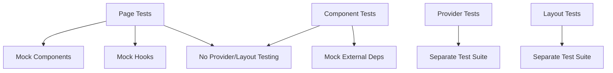

# Test Simplification Plan for Frontend Public Components

## Current State Analysis

### Existing Test Files

- `frontend/src/pages/public/__tests__/EmailVerification.test.tsx`: Tests EmailVerificationPage rendering with providers.
- `frontend/src/pages/public/__tests__/Home.test.tsx`: Tests HomePage with extensive layout and interaction testing.
- `frontend/src/pages/public/__tests__/PasswordReset.test.tsx`: Tests PasswordResetPage rendering with providers.
- `frontend/src/pages/public/__tests__/SignIn.test.tsx`: Actually tests SignInForm component (misplaced).
- `frontend/src/pages/public/__tests__/SignUp.test.tsx`: Actually tests SignUpForm component (misplaced).

### Missing Test Files

- No tests for `SignInPage` (pages/public/Signin.tsx).
- No tests for `SignupPage` (pages/public/Signup.tsx).
- No tests for `EmailVerificationForm` component.
- No tests for `PasswordResetForm` component.
- No `__tests__` directories in `components/public/`.

### Issues Identified

#### Duplication

- `SignIn.test.tsx` and `SignUp.test.tsx` have nearly identical structure: mock `useAuth`, test field rendering, form submission, and error handling.
- Provider setups (urql Provider, SnackbarProvider, MemoryRouter) are repeated across page tests.

#### Overstepping Scope

- Page tests wrap components in multiple providers and test provider behavior, which should be tested separately.
- `Home.test.tsx` tests layout components (MuiSheet-root, MuiBox-root) and theme responsiveness, which belong in layout/provider tests.
- `Home.test.tsx` mocks `SignInForm` but also tests its interactions, overlapping with form tests.
- Page tests assert on child component internals instead of focusing on page-level actions.

#### Misplaced Tests

- `SignIn.test.tsx` and `SignUp.test.tsx` are testing form components but located in page test directory.

## Proposed Simplified Structure

### Principles

- **Page tests**: Test only the page's composition, routing logic, and its own callbacks. Mock child components and hooks. Do not test providers or layout.
- **Component tests**: Test component rendering, user interactions, and logic. Mock external dependencies.
- **No provider testing in page/component tests**: Providers should have their own tests.
- **Consolidate similar tests**: Use shared helpers for common patterns.

### Test File Structure

```
frontend/src/
├── components/public/__tests__/
│   ├── EmailVerificationForm.test.tsx
│   ├── PasswordResetForm.test.tsx
│   ├── SignInForm.test.tsx
│   └── SignUpForm.test.tsx
└── pages/public/__tests__/
    ├── EmailVerification.test.tsx (simplified)
    ├── Home.test.tsx (simplified)
    ├── PasswordReset.test.tsx (simplified)
    ├── SignInPage.test.tsx (new)
    └── SignUpPage.test.tsx (new)
```

### Specific Changes

#### 1. Create Component Tests

- Move `SignIn.test.tsx` to `components/public/__tests__/SignInForm.test.tsx`.
- Move `SignUp.test.tsx` to `components/public/__tests__/SignUpForm.test.tsx`.
- Create `EmailVerificationForm.test.tsx`: Test form rendering, verification submission, resend code.
- Create `PasswordResetForm.test.tsx`: Test request/reset modes, form submission, resend code.

#### 2. Create Missing Page Tests

- `SignInPage.test.tsx`: Test that page renders SignInForm, handles navigation on sign in.
- `SignUpPage.test.tsx`: Test that page renders SignUpForm, handles navigation on sign up.

#### 3. Simplify Existing Page Tests

- `EmailVerification.test.tsx`: Remove providers. Mock `useSnackbar`. Test form rendering and callback invocations.
- `Home.test.tsx`: Remove layout assertions. Mock `SignInForm`. Test content rendering and navigation.
- `PasswordReset.test.tsx`: Remove providers. Mock `useSnackbar`. Test form rendering based on URL params.

#### 4. Consolidation Opportunities

- Form tests for SignInForm and SignUpForm are similar; consider a shared test helper for auth form patterns.
- No other consolidations needed as each test covers distinct scenarios.

## Implementation Plan

1. Create `__tests__` directories in `components/public/`.
2. Move and rename misplaced form tests.
3. Create new component tests for EmailVerificationForm and PasswordResetForm.
4. Create new page tests for SignInPage and SignupPage.
5. Refactor existing page tests to remove overstepping and duplication.
6. Update this document as tasks are completed.

## Mermaid Diagram: Test Dependencies



This plan ensures tests focus on their specific scope, eliminate duplication, and cover all components.
