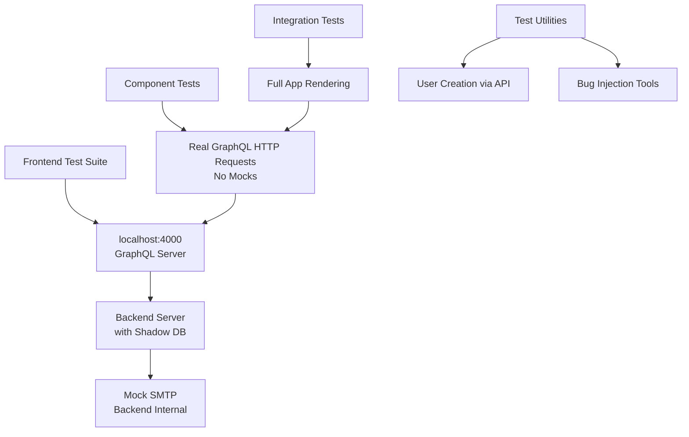

# Frontend Test Transformation Plan

## Overview

This document outlines the plan to transform frontend tests from mocked, isolated unit tests to integration tests using real GraphQL queries, actual test users in the database, and testing components with real backend interactions.

**Problem**: Current frontend tests use extensive mocking that prevents detecting real bugs. Tests pass regardless of backend state.

**Solution**: Implement integration testing with real backend interactions to ensure tests actually catch bugs.

## Key Changes Based on Feedback

- **Test Database**: Backend handles shadowDb internally - frontend tests don't import backend code
- **Server Management**: Frontend tests assume backend server is running on localhost:4000
- **Email Handling**: Keep mock SMTP (currently working well in backend tests)
- **CI/CD**: Design for production server testing capability to verify nginx routing etc.
- **Project Separation**: No imports from backend - use GraphQL HTTP requests only

## Architecture



## Implementation Plan

### Phase 1: Infrastructure Setup

1. **Shadow Database Integration**
   - Configure frontend tests to use `SHADOW_DATABASE_URL`
   - Ensure shadowDb is properly initialized for tests
   - Add environment variable handling for test mode

2. **Server Configuration**
   - Use existing server startup logic
   - Set `NODE_ENV=debug` for test environment
   - Configure test-specific GraphQL endpoint (localhost:4000)

3. **Email Handling & Verification**
   - Backend exposes debug GraphQL query for verification codes when NODE_ENV=debug
   - Frontend tests can retrieve verification codes via API instead of email
   - Enables real email verification testing without mocking
   - Test user cleanup uses @example.com pattern (handled by backend)
   - Backend server must run in debug mode for verification code access

### Phase 2: Test Conversion Strategy

4. **GraphQL Client Un-mocking**
   - Remove all urql mocks from `vitest.setup.ts`
   - Configure real client with test endpoint
   - Handle authentication tokens from real API responses

5. **Test User Management**
   - Create `frontend/tests/utils/testUsers.ts`
   - Functions to create verified/unverified users via real API
   - Extract and manage JWT tokens from signUp/signIn responses
   - Cleanup utilities for shadowDb isolation

6. **Component Test Conversion**
   - Replace mocked mutations with real GraphQL calls
   - Use API-created test users instead of mock objects
   - Test actual loading states, error handling, and UI updates
   - Verify form submissions persist real data

### Phase 3: Integration Testing

7. **Full Application Tests**
   - Add tests rendering complete app with React Router
   - Test authentication flows end-to-end
   - Verify protected routes with real auth state
   - Test complex user journeys with real backend

8. **Hook Testing Overhaul**
   - Convert useAuth tests to work with real Zustand store + API
   - Test token persistence, validation, and refresh
   - Verify auth state synchronization with backend

### Phase 4: Test Validation & Bug Injection

9. **Bug Injection Framework**
   - Create utilities to temporarily break backend functionality
   - Examples: corrupt responses, invalidate tokens, break validations
   - Systematic testing of error scenarios

10. **Coverage Verification**
    - Introduce known bugs and verify test failures
    - Document and fill test coverage gaps
    - Establish confidence in catching real issues

### Phase 5: Production Testing Capability

11. **CI/CD Integration**
    - Configure pipelines to run against production server
    - Use shadowDb for isolation during production testing
    - Verify nginx routing, SSL, and full stack integration
    - Enable comprehensive end-to-end validation

## Technical Implementation Details

**Server Availability Check:**

```typescript
// frontend/tests/setup.ts
export async function ensureBackendRunning() {
  try {
    const response = await fetch('http://localhost:4000/health');
    if (!response.ok) throw new Error('Backend not healthy');
  } catch (error) {
    throw new Error(
      'Backend server not running on localhost:4000. ' +
      'Please start the backend server with test configuration first.'
    );
  }
}
```

**Test User Creation:**

```typescript
// frontend/tests/utils/testUsers.ts
export async function createTestUser(email: string, verified = true) {
  // Real GraphQL mutation to signUp via HTTP
  // If verified=true, retrieve verification code via debug query
  // Complete email verification automatically
  // Extract JWT token from signIn response
  // Return user + token for tests
  // Backend handles shadowDb isolation
}

export async function getVerificationCode(email: string) {
  // Debug query: getVerificationCode(email: string)
  // Only works when backend NODE_ENV=debug
  // Returns verification code for completing email verification
}
```

**GraphQL Client Configuration:**

```typescript
// Configure urql client for tests
const testClient = createClient({
  url: 'http://localhost:4000/graphql',
  // No mocks - real HTTP requests
});
```

**Bug Injection Utility:**

```typescript
// frontend/tests/utils/bugInjection.ts
export function injectGraphQLError(operation: string, error: string) {
  // This would require backend cooperation
  // For now, test error scenarios by manipulating test data
}
```

## Benefits of This Approach

- **Leverages Existing Infrastructure**: Uses shadowDb and standard server
- **Production Testing**: Can run tests against production to verify full stack
- **Maintains Working Email Tests**: Keeps proven mock SMTP approach
- **Real Bug Detection**: Tests will fail when actual functionality breaks
- **CI/CD Ready**: Supports both development and production testing scenarios

This plan transforms your tests from "always passing mocks" to "real integration tests that catch actual bugs," while respecting your existing infrastructure and testing patterns.
