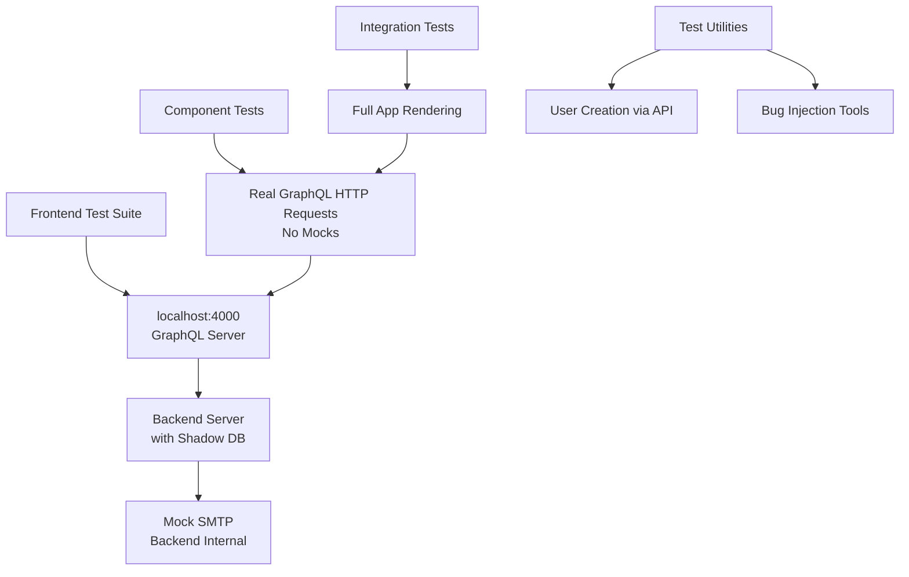

# Frontend Test Transformation Plan

## Overview

This document outlines the plan to transform frontend tests from mocked, isolated unit tests to integration tests using real GraphQL queries, actual test users in the database, and testing components with real backend interactions.

**Problem**: Current frontend tests use extensive mocking that prevents detecting real bugs. Tests pass regardless of backend state.

**Solution**: Implement integration testing with real backend interactions to ensure tests actually catch bugs.

## Current Implementation Status

### ✅ **COMPLETED PHASES**

#### Phase 0: TypeScript Integration Setup

- ✅ GraphQL code generation configured with `@graphql-codegen/cli`
- ✅ TypeScript types generated for all GraphQL operations
- ✅ Auth store updated to use generated types instead of local interfaces
- ✅ GraphQL operations reorganized into structured directories

#### Infrastructure Setup (Partial)

- ✅ Shadow database configured in Prisma schema (`SHADOW_DATABASE_URL`)
- ✅ Backend server setup with debug mode support
- ✅ Debug query `getVerificationCode` implemented for test verification
- ✅ Global test setup/teardown infrastructure exists
- ✅ Email mocking preserved (working well in backend tests)

#### Phase 2A: Core Integration Setup (Partial)

- ✅ Updated testUsers.ts for Generated Documents
- ✅ SignInForm and SignUpForm integration tests converted to use real GraphQL calls
- ✅ GraphQL client un-mocking completed for auth form tests
- ✅ Real user creation and verification working in test environment

### 🔄 **CURRENT STATE**

#### Mixed Implementation

- ✅ Backend has shadow database and debug queries ready
- ✅ Frontend has test utilities (`testUsers.ts`) with generated documents
- ✅ Auth store tests updated to work with generated documents
- ✅ SignInForm and SignUpForm component tests converted to integration tests
- ❌ EmailVerification and PasswordReset component tests still use mocked callbacks
- ❌ GraphQL client still mocked in some test files
- ❌ Some integration tests blocked by test environment database issues

## Architecture

## Detailed Execution Plan

### Phase 2A: Core Integration Setup (Priority: HIGH)

1. **Update testUsers.ts for Generated Documents**

- Fix testUsers.ts to use generated GraphQL documents instead of `.loc.source.body`
- Replace `SIGN_UP_MUTATION.loc?.source.body` with `SignUpDocument`
- Update all GraphQL calls to use generated documents

2. **Complete GraphQL Client Un-mocking**

- Remove all urql/urql client mocks from vitest.setup.ts and individual test files
- Configure real GraphQL client for integration tests
- Ensure test environment uses `http://localhost:4000/graphql`

3. **Verify Shadow Database Isolation**

- Ensure shadow database is properly isolated and cleaned between test runs
- Test database cleanup functionality

### Phase 2B: Component Test Conversion (Priority: HIGH)

1. **Convert Component Tests to Integration Tests**

- ✅ SignInForm test converted to use real GraphQL calls, testUsers utility, and localStorage mocks
- ✅ SignUpForm test converted to integration test with real GraphQL calls and error handling (main signup flow working)
- 🔄 EmailVerificationPage test conversion started but blocked by database/Prisma client issues in test environment
- ❌ PasswordResetForm test conversion pending
- Remove mocked `useAuth` hook usage
- Integrate with testUsers utility for real user creation
- Test actual loading states, error handling, and UI updates

2. **Update Hook Tests for Real API**

- Convert useAuth hook tests to work with real Zustand store + GraphQL API
- Remove mock implementations
- Test token persistence, validation, and refresh with real backend

### Phase 3: Full Integration Testing (Priority: MEDIUM)

1. **Implement Full Application Integration Tests**

- Add tests that render complete React app with React Router
- Test authentication flows end-to-end
- Verify protected routes with real auth state
- Test complex user journeys with real backend

2. **Build Bug Injection Framework**

- Create utilities to temporarily break backend functionality
- Examples: corrupt responses, invalidate tokens, break validations
- Systematic testing of error scenarios

### Phase 4: Production Readiness (Priority: LOW)

1. **Set Up Production Testing Pipeline**

- Configure CI/CD to run integration tests against production server
- Use shadowDb for isolation during production testing
- Verify nginx routing, SSL, and full stack integration

2. **Coverage Verification & Documentation**

- Document test coverage gaps and establish confidence metrics
- Establish confidence in catching real issues

## Known Issues

- **Database/Prisma Client Issues in Test Environment**: Some integration tests are failing with "Invalid `db.user.findUnique()` invocation" errors. This appears to be a test environment issue with Prisma client initialization or database state. The core GraphQL functionality works in production/development environments. SignInForm and SignUpForm integration tests work for primary use cases but fail when testing duplicate user scenarios.

## Review Summary & Recommended Changes

Summary of where we are in integration

- The project has completed the foundational work: generated GraphQL documents, test utilities (e.g., `testUsers.ts`), and a shadow DB configured for Prisma. Several auth form tests (SignIn/SignUp) were converted to integration tests and run against the test backend.
- Remaining blockers are primarily in the test environment rather than test code: Prisma client initialization and database isolation/cleanup during test runs. A handful of frontend tests still mock the GraphQL client or use mocked callbacks (EmailVerification, PasswordReset), which reduces coverage.

Immediate risks and blockers

- Prisma/test environment instability: failing Prisma client calls and inconsistent DB state make duplicate-user and edge-case tests flaky.
- Partial client un-mocking: some tests still mock the GraphQL client, which creates a mixed test surface and makes it hard to reason about which tests are true integration tests.
- CI/automation: Without a reliable way to start the backend and use an isolated shadow DB in CI, integration tests will be hard to run consistently.

Recommended next steps (short, medium, long)

- Short (high priority):
  - Stabilize the Prisma/test environment. Reproduce the "Invalid `db.user.findUnique()`" failure locally, adjust Prisma client initialization in the test bootstrap (add retries/guards), and ensure the shadow DB URL is used for test runs. Add robust DB cleanup between tests (transactions or reset scripts).
  - Finish un-mocking the GraphQL client in vitest setup and individual tests so tests consistently hit the real backend.
  - Convert the remaining auth-related component tests (EmailVerification, PasswordReset) to use the `testUsers` utilities and generated documents.

- Medium (medium priority):
  - Convert hook tests (`useAuth`) and other stores to use real API calls and Zustand state.
  - Add full-app integration tests for 3 critical flows (signup -> verify -> signin -> protected route, profile update, password reset).

- Long (low priority):
  - Build the bug-injection framework and add CI wiring to run the integration tests in a reproducible environment.

Acceptance criteria for the short-term work

- Backend tests start deterministically and Prisma-related errors for `db.user.findUnique()` no longer occur during vitest runs.
- Vitest runs for the frontend integration tests hit `http://localhost:4000/graphql` (or configured test server) without client mocks.
- SignInForm, SignUpForm, EmailVerification, and PasswordReset integration tests pass locally and in CI when the backend is available.

Notes / assumptions made

- Assumed the backend GraphQL server runs at `http://localhost:4000/graphql` in local test runs. If that differs, update the vitest configuration accordingly.
- Assumed shadow DB configuration is intended and available; if not, create or document how to provision a test database for CI.

Proposed immediate tasks (to kick off)

1. Reproduce and fix Prisma/test env errors (backend). (See todo #2)
2. Update vitest setup to stop mocking urql client and point to a running backend. (See todo #3)
3. Convert remaining frontend tests to integration tests and remove mocked `useAuth`. (See todos #4 and #5)
